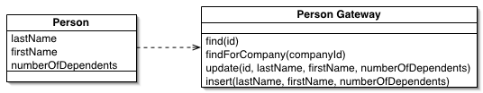

#Database

---

#Database Configuration

##global.php

	!php
	return [
		 'db' => [
			 'driver' => 'pdo',
			 'dsn' => 'mysql:dbname=guestbook;host=localhost',
			 'driver_options' => [
			 	PDO::MYSQL_ATTR_INIT_COMMAND => "SET NAMES 'UTF8'",
			 	PDO::ATTR_ERRMODE, 
			 	PDO::ERRMODE_EXCEPTION
		 ]],
	 ];

---
	 
#Database Configuration

##global.php

	!php
	return [
		 'db' => [
			 'driver' => 'pdo',
			 'dsn' => 'mysql:dbname=guestbook;host=localhost',
			 'driver_options' => [
			 	PDO::MYSQL_ATTR_INIT_COMMAND => "SET NAMES 'UTF8'",
			 	PDO::ATTR_ERRMODE, 
			 	PDO::ERRMODE_EXCEPTION
		 ]],
	 ];
	 
##local.php

	!php
	return [
		 'db' => [
			 'username' => 'root',
			 'password' => 'XXX',
		 ],
	];
	 
---

#Model

---

# Entity

Let's consider here an "entity" as a "business object".

Each instance represents an entry comment left on the site. 

## Attribute statements 

We have one protected attribute for each table column

	!php
	protected $id;
	protected $name;
	protected $email;
	protected $website;
	protected $message;

---
	
# Entity

## Method statements 

For the sake of simplicity, let's put setters and getters for these protected attributes.
Please note that this is NOT the best practice.

	!php
	 public function setId($id)
	 {
		 $this->id = $id;
		 return $this;
	 }

	 public function getId()
	 {
	 	return $this->id;
	 }

---

# DB Access with Zend\DB

##TableGateway

ZF2 furnish an implementation of the TableGateway pattern in order to ease interaction with DB. 

Let's use it in our simple application.

	!php
	use Zend\Db\TableGateway\TableGateway;
	class EntryTable extends TableGateway
	{
		 public function findAll()
		 {
			 return $this->select();
		 }
	}
 
 
---

# DB Access with Zend\DB

## TableGateway

	!php
	class TableGateway extends AbstractTableGateway
	
Let's look at its constructor params

	!php
	public function __construct($table, 
								AdapterInterface $adapter,
								$features = null,
							    ResultSetInterface $resultSetPrototype = null,
							    Sql $sql = null)
    

---

# DB Access with Zend\DB

##AbstractTableGateway

It implements the TableGatewayInterface:

 - select($where = null), 
 - insert($set),
 - update($set, $where = null),
 - delete($where)

    
    
